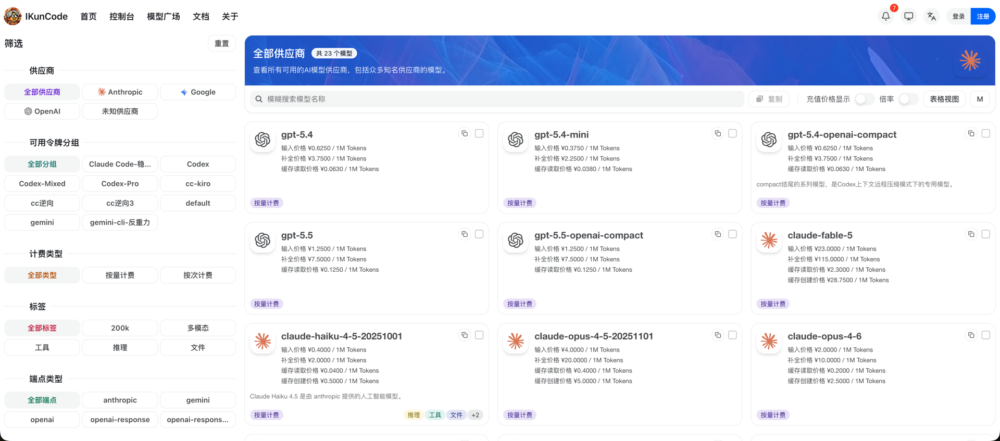

# AI APi中转站推荐与测评（持续更新，更新于2026-07-07）

## [1. 元点AI(airelay.pro)](https://www.airelay.pro)

元点AI是2026年新的站点，圈子里很多开发者都在用。主要是GPT和Claude模型，还支持最新的Fable 5、GPT5.5等，属于是比较稳定且性价比较高的类型。

都是按量付费的，并且标注了每个分组的具体情况，比如使用TEAM，K12，Pro池之类的，并且新用户默认送了额度，可以免费试用，试用完再决定要不要充钱（建议先测试，符合自己的使用要求再充值，用多少充多少）。

亲身体验下来，感觉速度、价格比较均衡，值得推荐。官方分组如下图（站点可能会更新，以站点为主哈）：

## [2. CUN.ai(cun.ai)](https://cun.ai)

cun.ai也是比较新的站点，主要优势在于支持的模型种类非常丰富，比如GPT、Claude、Deepseek、Qwen等都有，按量付费或套餐订阅都有。赠送额度多，价格就中规中矩，性价比一般。

不过可以用赠送的额度，测试一下是否符合自己的使用场景，符合后按需充值。

## [3. IKUNCode(api.ikuncode.cc)](https://api.ikuncode.cc/)

这是一个专注编程开发的API站点，只支持Claude、GPT和Gemini三大模型，名字设计得很有潮流感。

收费方式只有按量付费一种。

Claude Code里质量较好的稳定分组是 ClaudeCode-稳定，价格为 11.5（输入）/57.5（输出） 每百万Token，整体较稳定，速度也理想。GPT5.5的价格则是 1（输入）/6（输出） 每百万Token。

总体来说，是个比较靠谱的平台。

- [JiuRelay](https://jiurelay.com/) - Free AI API relay for GPT, Claude, GLM. No registration required, 1-hour valid key, OpenAI/Anthropic compatible.
